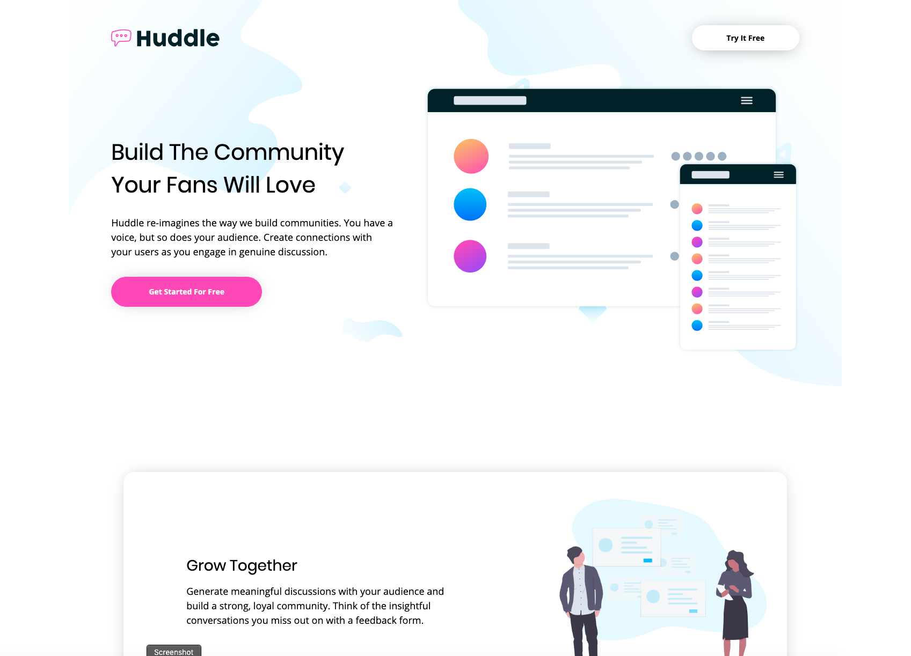

# Sample startup Compagny Landing Page

This fictitious company landing page was done for practice in vanilla HTML and CSS. It uses the LESS preprocessor for styling.

## Table of Contents

- [Screenshot](#screenshot)
- [Getting Started](#getting-started)
- [Stack](#stack)
- [Author](#author)
- [Acknowledgements](#acknowledgements)

## Screenshot

## Getting Started

### Opening the Site

- Fork or directly clone this repository to your local machine
- Open `index.html` in your browser of choice
- Enjoy!

### Editing the Site

- Fork or directly clone this repository to your local machine
- Open `index.html` in your browser of choice
- Start the LESS compiler by running `less-watch-compiler less css index.less` in the root directory
- Edit any HTML or CSS file according to your tastes
- Enjoy!

## Stack

- [HTML](https://www.w3.org/TR/html/)
- [CSS](https://css-tricks.com/)

## Author

- [Nathan Thomas](https://github.com/nwthomas)

## Acknowledgements

- Thank you to [Front-End Mentor](https://www.frontendmentor.io/) for giving out high quality design files for projects like this.
